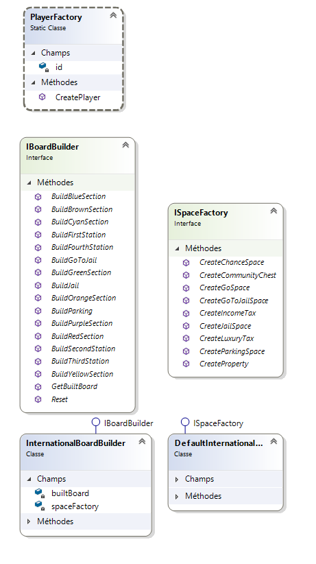

[](https://dev.azure.com/Projets-ESILV-AA/A4_DPSDP_Projet_Final_TD6/_build/latest?definitionId=2&branchName=master)


Monopoly Game : Final project in **Design Patterns and Software Development Process**
===================================================================

IPlayer interface, Player behavior and JailedPlayer decorator
-------------------------------------------------------------


To declare the behavior of a player, we\'ve created an ``IPlayer`` interface.

A player is defined by an id, a name, a character we use to display his position on the board, his current position, and the amount of money he has. We also store the values of the dices rolled and the number of consecutives double made with the dice.

The basic ``Player`` class implements this ``IPlayer`` interface.

Most of a player behavior remains the same no matter what happens during the game. However, when a player goes to Jail, he effectively changes behavior: He is no longer able to move during his turn, unless he rolls a double dice, or he stays in jail for 3 turns. To implement such a change of state, between a player and a jailed player, we used a **Decorator Pattern**, implemented through the ``JailedPlayer`` class. It allows us to change the behavior of the player without altering its structure.

``JailedPlayer`` being a ``Player`` decorator, it stores the instance of the player locally. For the functions that do not change based on the player's state (jailed/free), we simply call the ``Player``'s functions in the ``JailedPlayer`` functions. The other ones are modified to reflect the new behavior. Since the ``JailedPlayer`` implements the ``IPlayer`` interface, the other components of the program do not need to be aware of the player state to work with it.

To switch between a free player and a jailed player, we replace all instances of the ``Player`` to its ``JailedPlayer`` decorator: in the player list, but also from its owned properties for example.

Spaces classes
--------------


We modelled the spaces on the game board with an ``abstract`` Space class.
A ``Space`` is defined mainly by its id, and name, and the board instance it
is part of (see the Dependency Injection paragraph).

Any space that can be owned is defined as a ``Property``, inheriting the ``Space`` class. In addition to the basic Space data, these stores their
``IPlayer`` owner, a purchase price and a list of rent prices.

This class also makes a ``CanBeSold`` property available, since there are
conditions for that to be possible. There are different types of
``Property``: ``Land``, ``Railroad``, and ``Utility``. The properties have associated
colors, white being the one chosen for colorless properties like the
railroads.

The ``Railroad`` class has no special properties. It can according to the
rules always be sold, and its rent price depends on the number of
railroads the owner owns.

The ``Land`` class stores the number of houses on the space, and the price
to build one. We consider that 5 houses are the equivalent of the hotel
in the rules of the game of Monopoly. A ``Land`` can only be sold if there
is no house on it, so we check this condition in ``CanBeSold``

The rent also depends on the number of houses built. Since we have
stored the rent in a list of integers depending on their number of
houses, we call the element of this list corresponding to the number of
houses. We implemented various methods such as ``BuildHouse``, and
``IsHouseBuildable`` which checks that all the conditions needed to be able
to build a house are fulfilled.

Finally, the ``Utility`` spaces such as water and electricity company can also be owned. The rent of these spaces is quite particular, since it depends on
the rolled dice value by the player in order to end up stopping on these spaces.
Its rent is 4 times the dice value, and if both utilities are owned by the
same player it's 10 time the dice value.

Event spaces and their Actions delegates
-----------------------------------------

There are quite a few special spaces that execute specific actions when
walked on or stopped on, such as the *Go space*, *Go To Jail* space, *Chance*
spaces, and a few others. They only differ by their executed action on
stop/walk, so we chose to model these spaces as an ``EventSpace`` class. The
instances of this class are storing two ``Action<IPlayer>`` delegates
each: One for the event occurring when stopping on the space, and one
for the event occurring when walking over the space, like the Go Space
that gives money when walking on it. ``Action<IPlayer>`` is a generic
delegate type provided in the System namespace: it is defined as a
delegate returning void, and taking an IPlayer as a parameter.

In our case, we can thus provide the ``Action`` to realize when we
instantiate an event space, instead of defining multiple class for each
special space.

Visitor pattern
---------------

To model the ability of a player to visit a space when moving, (either
walking or stopping on a space), we implemented a **Visitor Pattern**
through our ``ISpaceVisitor`` and ``IVisitableSpace`` interfaces. The
``IVisitableSpace`` must accept a ``ISpaceVisitor`` and redirect to the correct
operation the visitor must execute on the space.

The ``IVisitableSpace`` declares that a Space must accept a visitor walking
on it without necessarily stopping, with the ``AcceptWalking`` method, and
stopping visitors with ``AcceptStopping``. Both these functions call the
appropriate method on the ``ISpaceVisitor``, depending on the type of Space
implementing ``IVisitableSpace``.

The ``ISpaceVisitor`` interface declares ``WalkOnProperty`` function, which
triggers an action that the player must execute when walking on a
specified property. In the same fashion, ``StopOnProperty``, ``WalkOnEvent``,
and ``StopOnEvent`` are defined. The *Visitor* does not need to know which
type of space it is visiting, it only calls the *VisitableSpace*'s
``AcceptStopping/Walking``, which calls the appropriate ``StopOnX/WalkOnX``
method.

In our program, the ``Stop/WalkOnEvent`` methods of a Player calls the Event
space's ``Stop/Walk`` *Action delegate*, mentioned in the previous paragraph.
walking on a property does nothing, and stopping on a property triggers
either the purchase of the property if the player wants to, or the
payment of a rent if it is already owned

Board class
-----------


A Board is a collection of ``IVisitableSpaces``. Its ``IBoard`` interface
inherits of the ``IReadOnlyList<IVisitableSpace>`` interface, and thus
requires any Board to make a few properties available - such as an
index operator to get a space by its index, and a count. We added some
more, like a FindAllSpaces function to retrieve specific spaces, and an
IndexOfSpace method to get the position of space on the board. Our ``Board.cs``
class implements the ``IBoard`` interface.

Game Singleton and Threads
--------------------------


The ``Game`` class was implemented as a singleton, since the program should
have only one game instance. An ``IGame`` interface defines its required
operations and information: A game instance has to store references to its
board and a list of its players, and has a few methods to ``Initialize`` the
game (both board and players).

In a typical user scenario, the board is automatically initialized, then
the users have to provide the players' names.

Thus, when initializing the game, it seemed more efficient to initialize
the game board in another thread, with the provided builder function,
while the players are initialized with the information that the user
gives. That way, we use the time the users take to enter their
information, instead of making them wait for an unrelated operation to
finish.

Once initialized, one can launch the game with the ``LaunchGame`` method,
which takes care of making every player play their turn in order,
removing the losers, and ending when there is one left . It is as
generic as possible, and refers to ``IPlayer`` and ``IBoard`` interfaces, so it
can be mostly reused with any other type of board game. For example,
losing is checked through the ``IPlayer.HasLost`` property, which could be
implemented differently if we ever created a new type of player,
following other rules.

View
----


The Game also stores an instance of an ``IView`` object. We defined an ``IView``
interface containing all user interface functions we would need.

To display information, we used a ``ConsoleView.cs``, implementing the ``IView``
interface. That way, we remain open to any extension: We could create a
``WindowsFormView.cs`` implementing ``IView``, and change the game's view on the
fly thanks to its View property.

Board Builder, Abstract Space Factory & Player Factory
------------------------------------------------------


In order to generate the board spaces with their appropriate names,
prices, and values, we created an Abstract Factory. Its interface,
``ISpaceFactory.cs``, declares the creation methods that must be provided in
such factories: methods to create Properties of course, by getting the
relevant information through the property name, but also the special
spaces such as the Go Space, Jail space, Taxes, etc.

Given that there are many variants of the Monopoly game, with different
spaces and street names, we could also have variants of our space
factory. For our project, we went with the international street names -
as implemented in the ``DefaultInternationalSpaceFactory.cs``. But the
implementation of the Abstract Factory interface makes us able to extend
the game if needed, by creating different Space factories implementing
this interface.

For example, we could create a ``DefaultFrenchSpaceFactory.cs`` with the
French street names, and let the user choose between the French names
and international English names.

To create the board, we have a fluent board builder, with its own
interface ``IBoardBuilder``, defining methods such as ``BuildOrangeSection()``,
``BuildJailSpace``, and so on.

Since a Board can be quite long (There are usually 8 color sections, and
quite a few special spaces in between), the Fluent Builder seemed more
appropriate than the classic Builder, since it allows us to chain calls.
For example  

```{C#}
builder.BuildGoSpace();
builder.BuildJailSpace();
```

 becomes

```{C#}
builder.BuildGoSpace().BuildJailSpace()
```

since every method of a builder
returns the builder instance itself.

That way, when building our board, it becomes very easy and intuitive to
add blocks or reorder them, and the order can be read easily as well.

Our default implementation of the board builder,
``InternationalBoardBuilder.cs``, can be instantiated with any space factory
implementing our previously defined factory interface in its
constructor. The builder takes care of the order and organization of the
spaces on our board, and gets the needed spaces instances from the
provided factory.

Once again, it means we can change the provided factory on the fly, and
eventually create other BoardBuilders if we ever decide that a colored
section should contain one more Land, for example.

Finally, a simple ``PlayerFactory.cs`` creates a player from its player name,
giving him the required initial amount of money, an auto-incrementing
id, and a display character.

Dependency injection
--------------------

With our initial implementation, we quickly noticed that the components
were too tightly coupled. The ``Game`` singleton was often called, even
inside individual spaces classes, which lead to difficulties unit
testing our code. Many tests couldn't be done without needing to
initialize the whole ``Game`` instance, ``Board``, and ``Players``.

After some research, we found the **Dependency Injection pattern** to be
quite relevant to this issue: Decoupling the classes and passing their
dependencies in the constructor enabled us to better test individual
methods and specific scenarios. And since we now relied on interfaces
definitions instead of specific class implementation, the code became
more flexible and more open to extensions.

We used this in a test, where instead of creating a whole board to test
a ``Player`` feature, we created a stub of the ``IBoard`` containing the needed
information, as a substitute of a real ``IBoard`` implementation like our
``Board.cs``, so that the player's unit test would not depend too much on
the ``IBoard`` implementation, and stay as generic as possible.

Event observation and regression tests
--------------------------------------

Our players have a ``OwnedProperties`` property, to list all the owned
properties of a specific player.

Lands also have a ``IsInMonopoly`` property, that indicates whether or not
all lands of the color groups are owned by the same player.

We used to have these properties execute a search on the board to
retrieve the corresponding spaces, and filter them as necessary, with a.
``FindAll()`` call on the space collections. However, we noticed that it was
quite inefficient to retrieve this information every time, since it is
only updated when a ``Property``'s ``Owner`` changes.

An **Observer pattern** to update this information seemed relevant at first
glance, but on further research it appeared more efficient to use the
**event system built into C\#**, that achieves the same thing.

The ``Property`` class has an ``OwnerChange`` event that stores the actions to
realize, and this event fired each time the Owner setter is used:
through the ``OnOwnerChange`` method, which calls all the functions
subscribed to the ``OwnerChange`` event, if any. For a ``Property``, when the
``Owner`` is updated, it only removes or add the ``Property`` instance to the
involved players' ``OwnedProperties`` list.

For a land, we added another subscriber: a ``UpdateColorMonopolyState``
method on the board that updates the lands of the same color group
``IsInMonopoly`` value depending on whether they now belong to the same
owner or not.

Since this feature was added near the end of the project, Unit tests for
these specific properties were already implemented, and quickly notified
us of any regression while changing to this event-driven approach.
